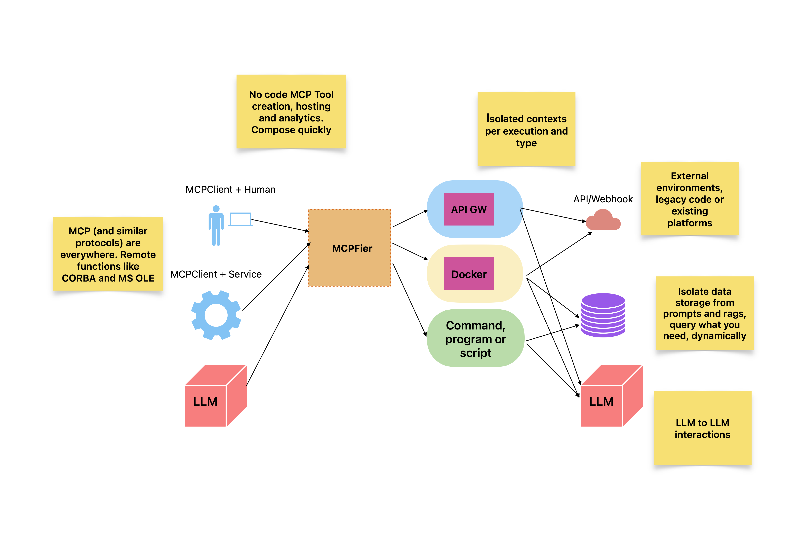
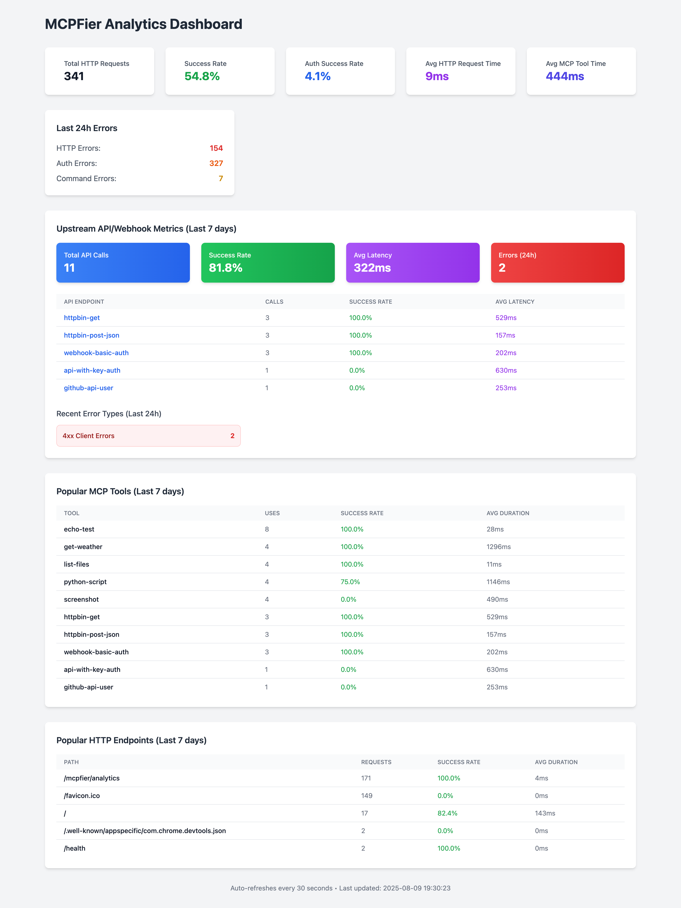

# MCPFier

MCPFier transforms any command, script, or tool into a standardized [MCP (Model Context Protocol)](https://modelcontextprotocol.io/docs/getting-started/intro) server that LLMs can use seamlessly.

A complete MCP-to-API gateway supporting three execution modes: local commands, containerized execution, and webhook/API calls. Ships with embedded analytics, authentication, and a web dashboard.

Think "GitHub Actions for MCP" with enterprise features - configure once, use everywhere with comprehensive monitoring and security.



## Quick Start for Claude Desktop

1. **Configure commands** in `config.yaml`:

   ```yaml
   commands:
     - name: get-weather
       script: curl
       args: ["https://wttr.in/?format=3"]
       description: "Get current weather"
   ```

2. **Generate setup instructions**:

   ```bash
   ./mcpfier --setup
   ```

3. **Add to Claude Desktop** using the JSON configuration from step 2

4. **Use in Claude**: "Use the get-weather tool"

## Features

- **Universal Tool Interface**: Transform any script into an MCP tool
- **Three Execution Modes**: Local commands, Docker containers, and HTTP webhooks/APIs
- **Dual Transport**: STDIO for desktop, HTTP for enterprise deployments
- **Complete MCP-to-API Gateway**: Full upstream API integration with authentication
- **Authentication Ready**: API keys with granular permissions
- **Embedded Analytics**: SQLite-based analytics with web dashboard
- **Enterprise Ready**: Multi-client support, request logging, monitoring
- **MCP 2025-06-18 Compliant**: Full specification compliance

## Configuration

Commands are defined in `config.yaml`:

```yaml
commands:
  # Local execution
  - name: list-files
    script: ls
    args: ["-la"]
    description: "List directory contents"
    timeout: "10s"

  # Containerized execution  
  - name: python-analysis
    script: python
    args: ["/app/analyze.py"]
    description: "Run data analysis"
    container: "python:3.9-slim"
    timeout: "5m"
    env:
      DATA_SOURCE: "production"

  # Webhook/API execution
  - name: httpbin-get
    description: "Test GET request to httpbin.org"
    timeout: "10s"
    webhook:
      url: "https://httpbin.org/get"
      method: "GET"
      headers:
        User-Agent: "MCPFier/1.0"

# Server configuration (HTTP mode)
server:
  http:
    enabled: true
    host: "localhost"
    port: 8080
    auth:
      enabled: true
      mode: "simple"
      api_keys:
        "mcpfier_dev_123456":
          name: "Development Key"
          permissions: ["*"]

# Analytics configuration
analytics:
  enabled: true
  database_path: "~/.mcpfier/analytics.db"
  retention_days: 30
```

### Command Configuration Fields

| Field         | Required | Description                      |
| ------------- | -------- | -------------------------------- |
| `name`        | Yes      | Unique tool identifier           |
| `script`      | No*      | Command or executable path       |
| `args`        | No       | Command arguments                |
| `description` | No       | Tool description for LLMs        |
| `container`   | No       | Docker image for isolation       |
| `webhook`     | No*      | Webhook configuration (see below)|
| `timeout`     | No       | Execution timeout                |
| `env`         | No       | Environment variables            |

*Either `script` or `webhook` must be specified.

### Webhook Configuration Fields

| Field           | Required | Description                          |
| --------------- | -------- | ------------------------------------ |
| `url`          | Yes      | Target API/webhook URL               |
| `method`       | No       | HTTP method (default: GET)           |
| `headers`      | No       | HTTP headers                         |
| `body`         | No       | Request body (for POST/PUT)          |
| `auth`         | No       | Authentication configuration         |
| `retry`        | No       | Retry policy configuration           |

### Analytics Configuration

| Field            | Required | Description                                 |
| ---------------- | -------- | ------------------------------------------- |
| `enabled`        | No       | Enable/disable analytics (default: false)   |
| `database_path`  | No       | SQLite database path (supports ~ expansion) |
| `retention_days` | No       | Days to retain analytics data               |

### Configuration File Discovery

MCPFier searches for `config.yaml` in the following order:

1. Path specified by `MCPFIER_CONFIG` environment variable
2. Current working directory (`./config.yaml`)
3. Directory containing the mcpfier executable
4. User's home directory (`~/.mcpfier/config.yaml` or `~/mcpfier/config.yaml`)
5. System-wide location (`/etc/mcpfier/config.yaml`)

Use `--config <path>` to specify a custom configuration file path.

## Command Line Options

```bash
./mcpfier [OPTIONS] [COMMAND]

Options:
  --config, -c <path>    Specify custom configuration file path
  --mcp                  Start MCP local STDIO mode
  --server               Start MCP server mode (HTTP)
  --setup                Generate Claude Desktop configuration
  --analytics            Show usage analytics and statistics
  --help, -h             Show help information


Examples:
  ./mcpfier --config ./my-config.yaml --mcp
  ./mcpfier -c /etc/mcpfier/config.yaml echo-test
  ./mcpfier --analytics --config ~/.mcpfier/config.yaml
```

## Installation

```bash
git clone https://github.com/gleicon/mcpfier.git
cd mcpfier
go build -o mcpfier
```

## Usage Modes

MCPFier supports two transport modes to fit different use cases:

### STDIO Mode (Default - for Claude Desktop)

Perfect for local development and Claude Desktop integration:

```bash
./mcpfier --mcp                    # Start STDIO MCP server (default)
./mcpfier --setup                  # Generate Claude Desktop config
./mcpfier --mcp --config /path    # Use custom config file
```

### HTTP Server Mode (Enterprise - with Authentication)

For production deployments, multiple clients, and enterprise features:

```bash
./mcpfier --server                 # Start HTTP MCP server with authentication
./mcpfier --server --config /path # HTTP server with custom config
```

**For complete HTTP server setup and authentication guide, see [SERVER.md](SERVER.md)**

### CLI Tool (Legacy)

```bash
./mcpfier command-name             # Execute command directly
./mcpfier --config /path cmd-name  # Use custom config for command
```

### Analytics

View usage statistics and command performance:

```bash
./mcpfier --analytics               # Show analytics for last 7 days
./mcpfier --analytics --config /path # Use custom config for analytics
```

Analytics tracks:

- Command execution statistics (local, container, webhook modes)
- HTTP server metrics with request/response tracking
- Authentication success and failure rates
- Upstream API call success rates and latencies
- Error categorization and breakdown by type
- Real-time performance monitoring

The embedded web dashboard provides comprehensive analytics when running in HTTP server mode. Access at http://localhost:8080/mcpfier/analytics (default configuration).



**Note**: The analytics database directory must exist before starting MCPFier. Create the directory manually:

```bash
mkdir -p ~/.mcpfier  # For default config
```

## Architecture

MCPFier implements a modular architecture with three execution engines:

- **Configuration**: YAML-based command definitions with auto-discovery
- **Transport**: Dual-mode support (STDIO for desktop, HTTP for enterprise)
- **Execution Engines**: Local commands, Docker containers, and HTTP webhooks/APIs
- **Analytics Engine**: SQLite-based embedded analytics with web dashboard
- **Authentication**: API key-based authentication with granular permissions
- **MCP Server**: [MCP 2025-06-18](https://modelcontextprotocol.io/specification/2025-06-18) compliant
- **Security**: Container isolation, authentication, request validation, resource limits

## Security

- **Local Mode**: Fast execution, same privileges as MCPFier
- **Container Mode**: Complete isolation, no host access, resource limits
- **Best Practices**: Use containers for untrusted code, define timeouts, limit privileges

## Use Cases

- **Enterprise Integration**: Transform internal APIs and workflows into MCP tools
- **Development Tools**: Linting, testing, building, deployment automation  
- **Infrastructure**: Health checks, log analysis, backup operations
- **API Gateway**: Bridge MCP clients to existing REST APIs and webhooks
- **Hybrid Workflows**: Combine local scripts, containerized tools, and external APIs
- **AI Agents**: Enable LLMs to access enterprise systems and external services

## Testing

```bash
go test ./...              # Run all tests
./mcpfier echo-test        # Test CLI mode
./mcpfier --setup          # Test MCP configuration
./mcpfier --analytics      # Test analytics (requires ~/.mcpfier/ directory)
```

## Documentation

- **[SERVER.md](SERVER.md)** - HTTP server setup and authentication guide
- **[SETUP.md](SETUP.md)** - Detailed setup instructions  
- **[ARCHITECTURE.md](ARCHITECTURE.md)** - Technical architecture
- **[AUTHENTICATION.md](AUTHENTICATION.md)** - Technical details on authentication

## External References

- **[MCP Specification](https://modelcontextprotocol.io/specification/2025-06-18)** - Official Model Context Protocol 2025-06-18 specification
- **[mcp-go Library](https://github.com/mark3labs/mcp-go)** - Go library for MCP implementation used by MCPFier
- **[Claude Desktop](https://claude.ai/download)** - Desktop client that works with MCPFier STDIO mode

## Contributing

We welcome contributions! Please see our documentation for:

- Architecture decisions and design patterns
- Security considerations and testing requirements
- Roadmap and planned features

## License

MIT License - see LICENSE file for details